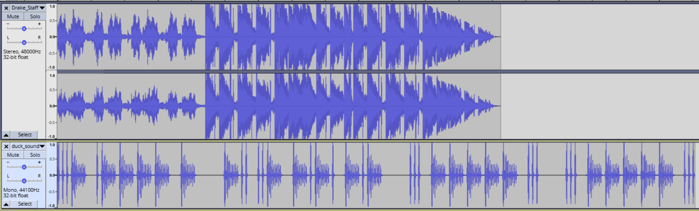
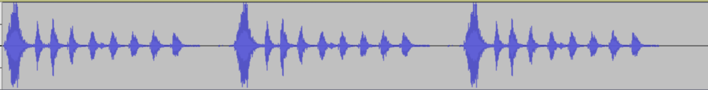

# v1tCTF 2025 - Talking Duck
## Category: Misc

### Exploitation
- Dữ liệu được cung cấp là 1 file audio (.wav). Vì vậy, ta sử dụng các tool phân tích audio để thực hiện

- Ở đây sử dụng [Wavacity](https://wavacity.com) để phân tích:
    
    

- Sau khi import, nhận thấy trong file có chứa 2 đoạn audio:
    - Drake_Staff (Đây có thể là đoạn gây nhiễu)
    - duck_sound

- Tập trung phân tích `duck_sound`. Sau khi loại bỏ `Drake_Staff`, phóng to đoạn audio của `duck_sound`, có thể thấy đoạn audio chỉ chứa 2 loại âm
    
    
    

- Suy đoán rằng đây rất có thể là mã Morse. Thực hiện phân tích thủ công:
    - Âm dài sẽ là `-`
    - Âm ngắn sẽ là `.`
    - Khoảng trống ngắn sẽ là ngăn cách giữa các ký tự (`space`)
    - Khoảng trắng dài sẽ là ngăn cách giữa các từ (`/`)

- Sau khi phân tích, ta được kết quả như sau:
```
...- .---- - / -.. ..- -.-. -.- / ... ----- ... / ... ----- ...
```

- Dịch mã Morse, thu được:

    


### Result
```
v1t{v1t_duck_s0s_s0s}
```