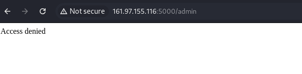
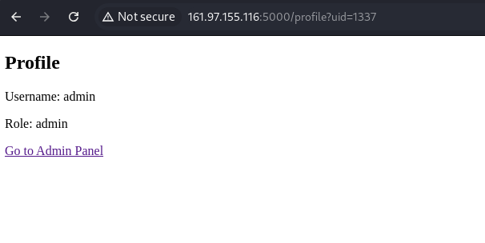
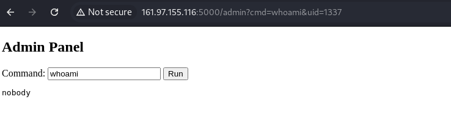
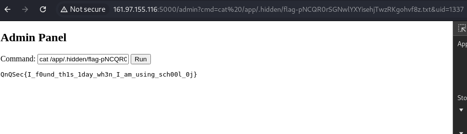

# QnQSec CTF - easy web
## Category: Web

### Exploitation
- Thử truy cập vào link Example, và kiểm tra thêm 1 số link

    
    

- Trong file `back`, flag đã được di chuyển và đổi tên -> Không thể sử dụng các cách thông thường như LFI, mà cần RCE

- Sau khi thử `id` nhiều lần và thử các cách như SQL Injection, Command Injection, SSTI,... đều không được

- Phát hiện `uid=1337` chính là của `admin`
    
    

- Tại đây, có thể thực hiện command -> Tìm kiếm và lấy flag

    


    ```
    http://161.97.155.116:5000/admin?cmd=cat%20/app/.hidden/flag-pNCQR0rSGNwlYXYisehjTwzRKgohvf8z.txt&uid=1337
    ```
    


### Result
```
QnQSec{I_f0und_th1s_1day_wh3n_I_am_using_sch00l_0j}
```