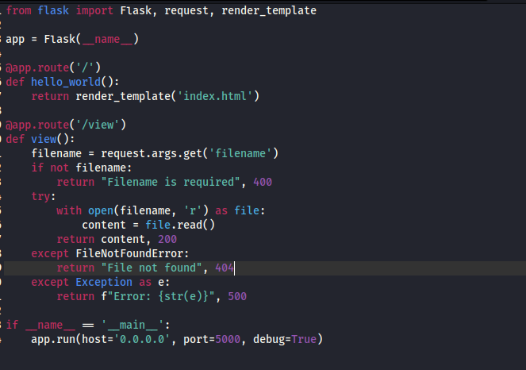
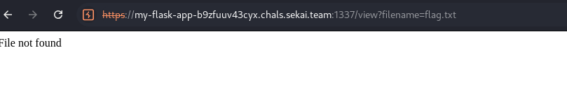
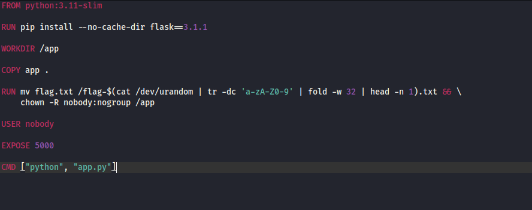

# SEKAI - My Flask App
## Level: *

### Exploitation

---

### 1. Khám phá lỗ hổng
- Trang chính không có gì để khai thác. Có thể thấy, không thể lấy flag


- Trong source code được cung cấp, nhận thấy trang web có cơ chế truy cập internal file thông qua `/view?filename=[FILE_NAME]`



- Từ đây, có thể kết luận lỗ hổng là LFI


### 2. Khai thác
- Cũng trong source code, file `flag.txt` được lưu cùng thư mục với `app.py`, thử truy cập bằng `view?filename=flag.txt`

- Tuy nhiên, kết quả lại trả về là `File not found`

- Thử tương tự với `../flag.txt`, `../../flag.txt` đều không được



- Trong file `Dockerfile`, có thể thấy file `flag.txt` được chèn thêm 1 chuỗi 32 chữ số. Như vậy, không thể lấy thông tin bằng cách truy cập trực tiếp



- Xác định nhiệm vụ:
    - Tìm vị trí của file và tên file `flag.txt` sau khi thay đổi

- Sử dụng payload:
```
/view?filename=/proc/self/mounts
```
thu được kết quả như sau:


- Như vậy, đã có tên file. Tiến hành truy xuất thông tin, thu được FLAG:


### 3. Kết quả
```
FLAG: SEKAI{Is-tHi5-3ven-(all3d_a_cv3}
```

### 4. Giải thích
**`proc/self/mounts`** là gì?

- Đây là một file ảo trong Linux, thuộc procfs (process filesystem).

- Nó chứa danh sách tất cả các filesystem (mount points) mà tiến trình hiện tại có thể thấy.

- Nội dung của /proc/self/mounts thường giống với /etc/mtab


Ứng dụng trong challenge
- Flag được lưu ở **`/flag-<random32>.txt`**.

- Nếu file này được mount vào container (hoặc nằm trong layer), đường dẫn đầy đủ của nó có thể hiện ra trong **`/proc/self/mounts`** hoặc **`/proc/self/maps`**.

- Vì vậy, đọc **`/proc/self/mounts`** đôi khi giúp leak chính xác tên file flag mà không cần brute-force